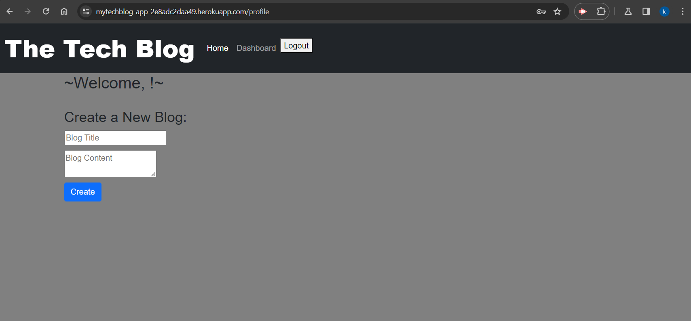
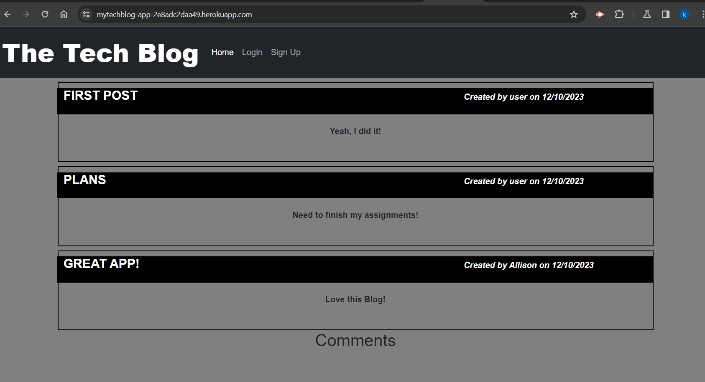
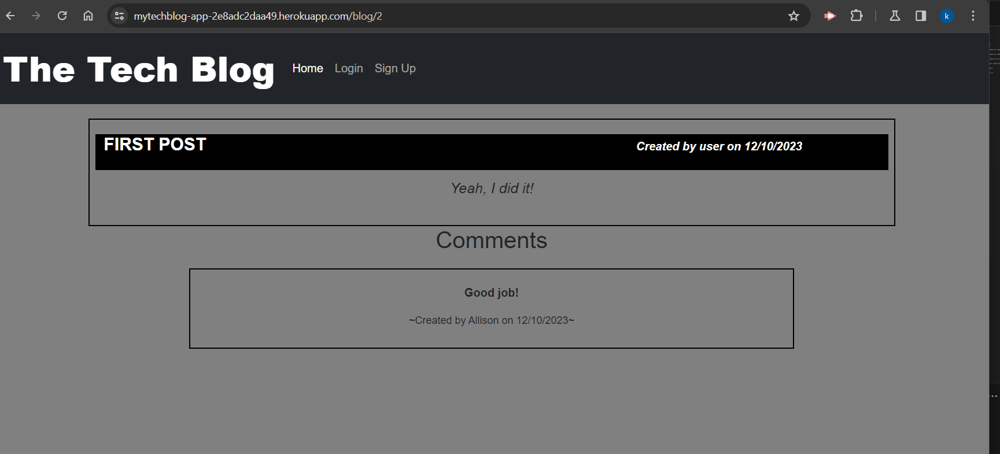

# tech-blogMVC

 
  

## Description
📙 This is a Tech blog Application, where user can register, sign in, Post, update and delete their content, As well as see other users post and comment on them. 

## Table of Contents
- [Description](#description)
- [Installation](#installation)
- [Usage](#usage)
- [License](#license)
- [Contributing](#contributing)

## Installation

⚙️ Clone Repo

⚙️ Npm I

⚙️ Node server

## Usage

💻 Deployed URL:

https://mytechblog-app-2e8adc2daa49.herokuapp.com/ 

## Mock-up

Comments:

## License

 

This application is covered by the MIT license. 

## Contributing

Used mini project as reference

Used Tutors help with deployment

